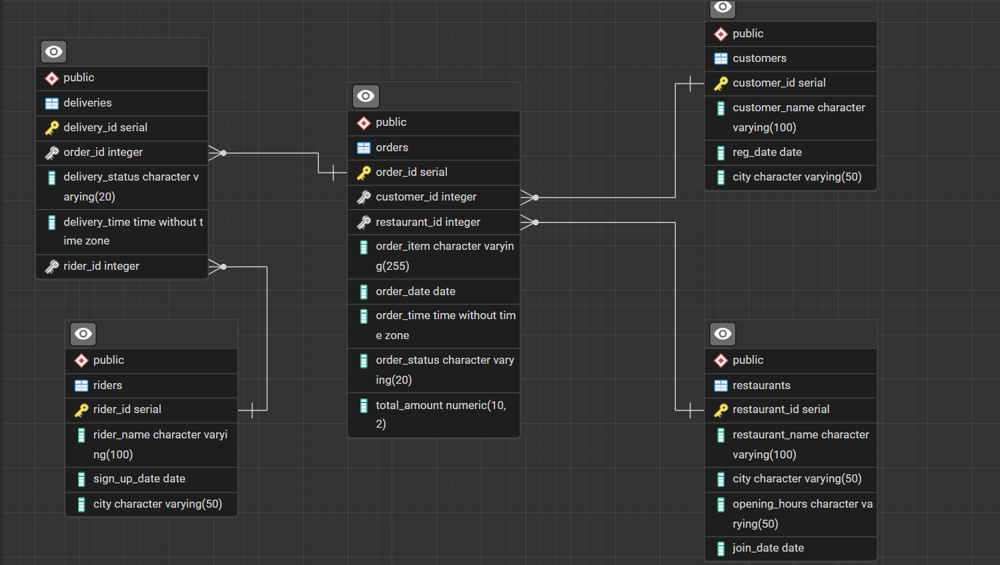

# 🍔 Food Delivery Database Design (PostgreSQL)

A real-world **relational database & analytics project** designed for a food delivery platform (Zomato / Swiggy style).

This project demonstrates **data modeling, SQL querying, and business analysis** skills expected from a Data Analyst.

---

## 📌 Project Objective
To design a scalable and analytics-ready database that enables:
- Order tracking
- Revenue analysis
- Rider performance evaluation
- City-wise business insights

---

## 🗂️ Database Entities
| Table | Description |
|------|------------|
| customers | Customer details and location |
| restaurants | Restaurant onboarding and city |
| orders | Order transactions and revenue |
| riders | Delivery partners |
| deliveries | Delivery status and timing |

---

## 🧩 ER Diagram

---

## 🛠️ Tech Stack
- PostgreSQL
- SQL
- ER Modeling
- Window Functions
- Aggregations

---

## 📊 Business Questions Solved
- How do monthly sales trends change over time?
- Which riders have the fastest average delivery times?
- Which cities generate the highest revenue?
- What are the most popular order items?
- How many deliveries are completed vs pending?

